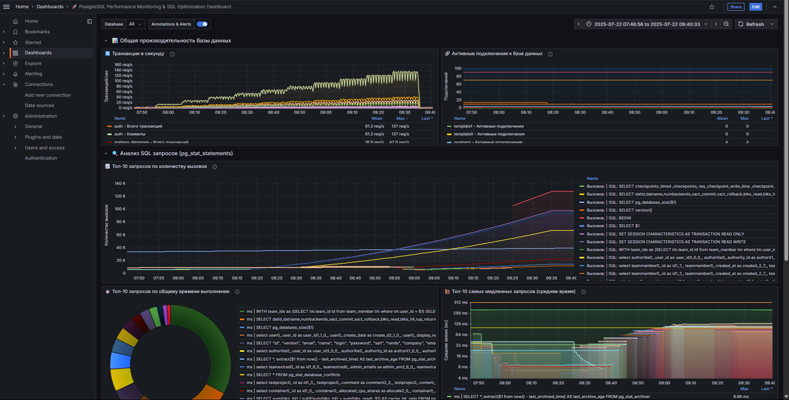
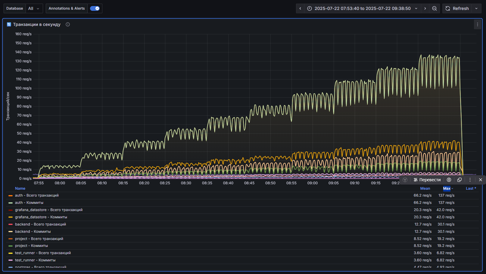
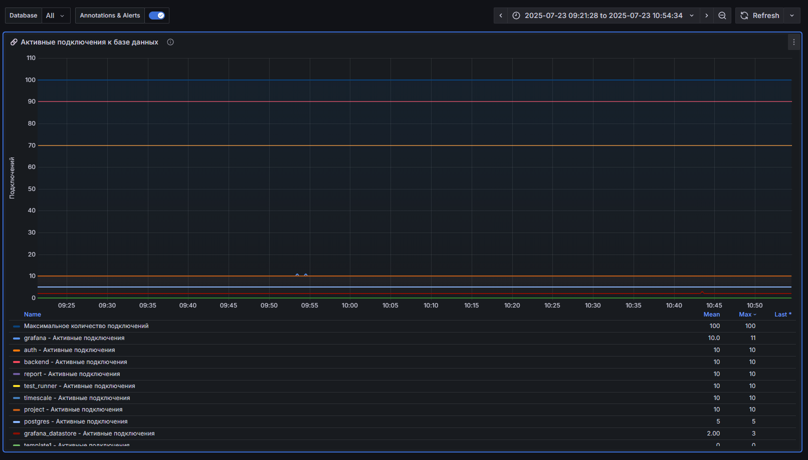
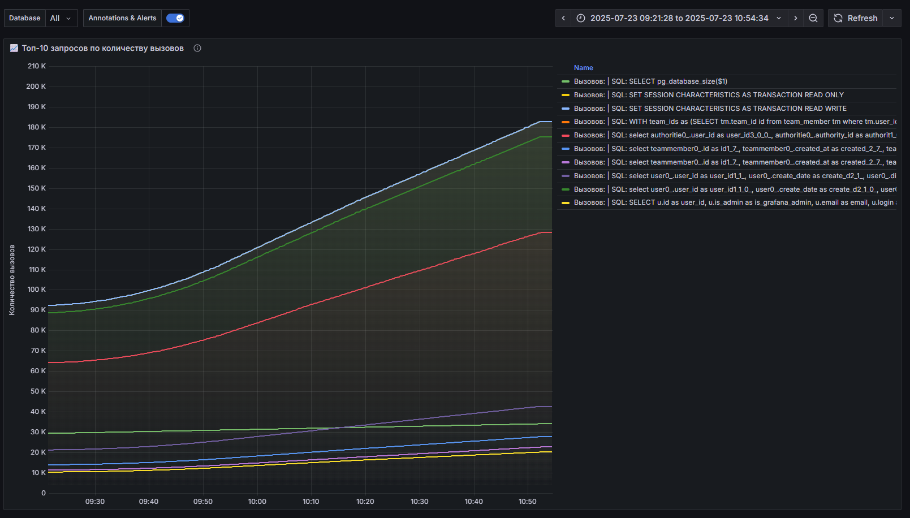
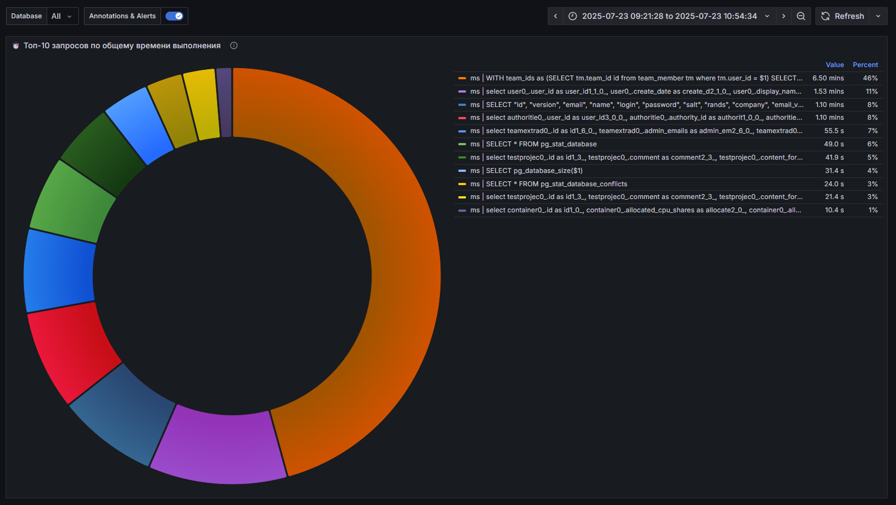
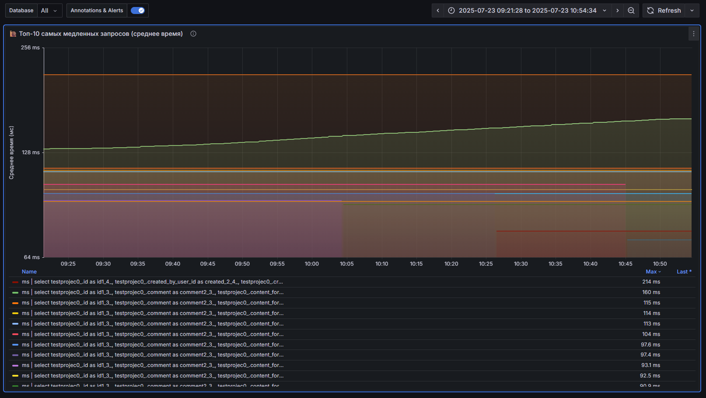
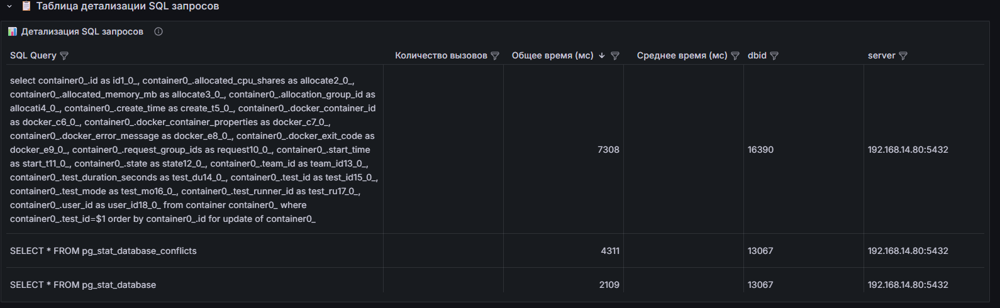

# 🚀 Дашборд для мониторинга производительности PostgreSQL и оптимизации SQL

Этот дашборд в **Grafana** предоставляет комплексный обзор производительности вашей базы данных **PostgreSQL**. Он помогает выявлять узкие места, оптимизировать медленные SQL-запросы и обеспечивать стабильную работу ваших приложений.

> *(рис. 1: Общий вид дашборда)*

---

## 📜 Оглавление

- [Обзор](#обзор)
- [Ключевые разделы дашборда](#ключевые-разделы-дашборда)
  - [📊 Общая производительность базы данных](#общая-производительность-базы-данных)
  - [🔍 Анализ SQL-запросов (pg_stat_statements)](#анализ-sql-запросов-pg_stat_statements)
- [Описание панелей](#описание-панелей)
  - [🔄 Транзакции в секунду](#транзакции-в-секунду)
  - [🔗 Активные подключения к базе данных](#активные-подключения-к-базе-данных)
  - [📈 Топ-10 запросов по количеству вызовов](#топ-10-запросов-по-количеству-вызовов)
  - [⏱️ Топ-10 запросов по общему времени выполнения](#топ-10-запросов-по-общему-времени-выполнения)
  - [🐌 Топ-10 самых медленных запросов (среднее время)](#топ-10-самых-медленных-запросов-среднее-время)
  - [📋 Детализация SQL-запросов](#детализация-sql-запросов)
- [Установка](#установка)
- [Как использовать дашборд для оптимизации](#как-использовать-дашборд-для-оптимизации)
- [Совместное использование с другими дашбоардами](#использование-совместно-с-другими-дашбордами)
- [Документация](#полная-документация)
- [Лицензия](#license-mit)

---

## Обзор

Этот дашборд создан для **администраторов баз данных** и **разработчиков**, чтобы в реальном времени отслеживать состояние **PostgreSQL**. Основное внимание уделяется двум аспектам:

- общей нагрузке на базу данных,
- производительности отдельных SQL-запросов (используя расширение `pg_stat_statements`).

---

## Ключевые разделы дашборда

### 📊 Общая производительность базы данных

Этот раздел дает **высокоуровневое представление** о здоровье вашей БД. Он помогает быстро оценить текущую нагрузку и количество клиентских подключений.

---

### 🔍 Анализ SQL-запросов (pg_stat_statements)

Это **сердце дашборда**. Здесь вы можете найти самые "дорогие" запросы, которые потребляют больше всего ресурсов. Анализ этих данных - ключ к оптимизации производительности.

---

## Описание панелей

### <h3 id="транзакции-в-секунду">🔄 Транзакции в секунду

- **Что показывает**: Общее количество транзакций (коммиты + откаты) в секунду.
- **Зачем нужно**: Помогает понять общую активность базы данных. Резкие скачки или падения могут указывать на изменения в нагрузке или проблемы.

> *(рис. 2: График транзакций в секунду)*

---

### <h3 id="активные-подключения-к-базе-данных">🔗 Активные подключения к базе данных

- **Что показывает**: Текущее количество активных подключений в сравнении с установленным максимумом (`max_connections`).
- **Зачем нужно**: Постоянно высокое количество подключений или приближение к лимиту может привести к отказам в обслуживании. Это может быть сигналом к оптимизации пула соединений в приложении.

> *(рис. 3: График активных подключений)*

---

### <h3 id="топ-10-запросов-по-количеству-вызовов">📈 Топ-10 запросов по количеству вызовов

- **Что показывает**: Самые часто выполняемые запросы.
- **Зачем нужно**: Даже быстрые, но очень частые запросы могут создавать значительную нагрузку. Оптимизация таких запросов (например, через кеширование на стороне приложения) может дать большой выигрыш.

> *(рис. 4: График топ-10 запросов по вызовам)*

---

### <h3 id="топ-10-запросов-по-общему-времени-выполнения">⏱️ Топ-10 запросов по общему времени выполнения

- **Что показывает**: Запросы, которые в сумме потратили больше всего времени CPU. Это произведение количества вызовов на среднее время выполнения.
- **Зачем нужно**: Это главный кандидат на оптимизацию! Запрос может быть не самым медленным, но если он выполняется тысячи раз, его суммарное влияние огромно.

> *(рис. 5: Диаграмма топ-10 запросов по общему времени)*

---

### <h3 id="топ-10-самых-медленных-запросов-среднее-время">🐌 Топ-10 самых медленных запросов (среднее время)

- **Что показывает**: Запросы с самым большим средним временем выполнения.
- **Зачем нужно**: Эти запросы напрямую влияют на "отзывчивость" вашего приложения. Их оптимизация улучшит пользовательский опыт. Часто здесь можно найти запросы, которым не хватает индексов.

> *(рис. 6: График самых медленных запросов)*

---

### <h3 id="детализация-sql-запросов">📋 Детализация SQL-запросов

- **Что показывает**: Интерактивная таблица со всеми отслеживаемыми запросами и их метриками (вызовы, общее время, среднее время).
- **Зачем нужно**: Позволяет глубоко анализировать данные. Вы можете сортировать запросы по разным параметрам, фильтровать их и копировать текст запроса для дальнейшего анализа с помощью `EXPLAIN ANALYZE`.

> *(рис. 7: Таблица с детализацией запросов)*

---

## Установка

1. Убедитесь, что у вас установлен и настроен **Prometheus** с `pg_exporter` (или аналогичным экспортером метрик PostgreSQL).
2. Убедитесь, что в PostgreSQL включено расширение `pg_stat_statements`.
3. В **Grafana** перейдите в раздел **Dashboards**.
4. Нажмите **New** и выберите **Import**.
5. Загрузите предоставленный JSON-файл или вставьте его содержимое в текстовое поле.
6. Выберите ваш источник данных **Prometheus** и завершите импорт.

---

## Как использовать дашборд для оптимизации

1. Начните с **"Топ-10 запросов по общему времени выполнения"**. Это самые важные цели.
2. Скопируйте текст проблемного запроса из таблицы **"Детализация SQL-запросов"**.
3. Используйте `EXPLAIN ANALYZE` в `psql` или `pgAdmin`, чтобы посмотреть план выполнения запроса.
4. Ищите узкие места:
   - Sequential Scans на больших таблицах (часто указывает на отсутствие индекса),
   - Вложенные циклы (Nested Loops) с большим количеством итераций и т.д.
5. Создайте необходимые индексы или перепишите запрос.
6. Наблюдайте за дашбордом после внесения изменений, чтобы оценить эффект.

---

## Использование совместно с другими дашбордами

### 1. Системные ресурсы сервера

- **CPU Usage**: Загрузка процессора (по ядрам и в целом). Помогает понять, не упирается ли производительность в "железо".
- **Memory Usage**: Использование оперативной памяти. Важно отслеживать, чтобы избежать ухода в swap.
- **Disk I/O**: Активность дисков (чтение/запись в секунду, утилизация). Высокая утилизация диска — явный признак узкого места.
- **Network Traffic**: Сетевой трафик. Полезно для понимания общего объема передаваемых данных.

---

### 2. Внутренние метрики PostgreSQL

- **Cache Hit Rate (Коэффициент попадания в кэш)**:
  - **Index Hit Rate**: `pg_statio_user_indexes`
  - **Table (Heap) Hit Rate**: `pg_statio_user_tables`
  - **Цель**: Значения должны быть как можно ближе к 99%+. Низкий показатель говорит о том, что БД постоянно читает с диска, и, возможно, стоит увеличить `shared_buffers`.

- **Vacuum и Autovacuum**:
  - Количество "мертвых" кортежей (dead tuples) в таблицах (`pg_stat_user_tables`).
  - Время последнего автовакуума для каждой таблицы.
  - **Зачем**: Помогает отслеживать, справляется ли автовакуум со своей работой. Большое количество мертвых кортежей раздувает таблицы и снижает производительность.

- **Locks (Блокировки)**:
  - График, показывающий количество и длительность активных блокировок.
  - Особенно важно отслеживать блокировки, которые ожидают (`waiting = true`). Помогает находить "зависшие" транзакции, блокирующие работу других.

- **Replication Status (Статус репликации)**:
  - **Replication Lag**: Отставание реплики от мастера в байтах или секундах. Критически важный показатель для систем с высокой доступностью.

- **Temporary Files (Временные файлы)**:
  - Количество и размер временных файлов, создаваемых PostgreSQL.
  - Если их много, это может означать, что `work_mem` недостаточно для сложных сортировок и соединений в памяти.

---

### 3. Бизнес-метрики и логи

- **Логирование медленных запросов**: Настройте `log_min_duration_statement` в PostgreSQL и собирайте логи с помощью **Promtail** в **Loki**. Это позволит вам видеть медленные запросы с конкретными параметрами, а не обобщенные, как в `pg_stat_statements`.

- **Бизнес-транзакции**: Свяжите технические метрики с бизнес-процессами. Например:
  - "среднее время оформления заказа"
  - "количество регистраций в минуту"
  
  Это поможет показать влияние технических проблем на бизнес.

---

Собрав все это на одном или нескольких связанных дашбордах, вы получите **360-градусный обзор вашей системы** и сможете решать проблемы **проактивно**, а не после жалоб пользователей.

## Полная документация

Документация доступна [здесь](./docs/postgres-exporter-dashboard.pdf).

## License [MIT](./LICENSE.md)